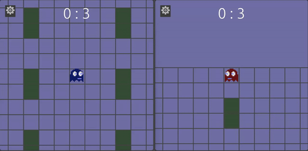

#  GHOST BATTLE 

A one versus one ghost battling game to the (extra?)death.

Designed in Bevy game engine initially based on the following game design tutorial series: https://johanhelsing.studio/posts/extreme-bevy
Project for me to learn the basics of the bevy ecs system as well as: peer2peer deterministic synchronized game states utilizing ggrs rollback, wave function map generation, deterministic random generation, and other novel game design concepts.

[LIVE DEMO](https://segfault.site/ghost)



## Features

- peer to peer networking
- non authoritative deterministic net code and game logic
- desktop, mobile, and web (wasm) support
- two player versus mode
- deterministic seeded map generation
- game music
- retro sound effects
- fun competitive gameplay


## Building
### Setup
- first install cargo and rust using [rustup](https://rustup.rs/)
- then add wasm target: `rustup target add wasm32-unknown-unknown`
- install wasm server runner `cargo install wasm-server-runner`
- install cargo watch `cargo install cargo-watch`
- deploy the signaling Worker in [`cloudflare-worker`](cloudflare-worker/README.md)
- route the Worker under `/match` on a Cloudflare-proxied game host, or set `GHOST_BATTLE_SIGNALING_URL` at compile time to its `workers.dev` `/match` endpoint

### Build and run

- build with `cargo build --release --target wasm32-unknown-unknown`
- run with `cargo run --target wasm32-unknown-unknown`
- auto compile and test for development with `cargo watch -cx "run --release --target wasm32-unknown-unknown"`

## Deploying

- Requires wasm-bindgen-cli `cargo install wasm-bindgen-cli`
- optional wasm-opt: `cargo install wasm-opt --locked`
- then run the commands from deploy.bat


## Networking

A Cloudflare Durable Object pairs two browsers and relays WebRTC signaling only; GGRS game traffic remains peer-to-peer. See [`cloudflare-worker/README.md`](cloudflare-worker/README.md). By default the game connects to `/match` on its own origin; set compile-time `GHOST_BATTLE_SIGNALING_URL` when the game host is not Cloudflare-proxied. Browser networking uses STUN without TURN, so restrictive NAT/firewall combinations may fail. Native builds compile, but online play is browser-only.

```
cargo build --release --target wasm32-unknown-unknown
wasm-bindgen --out-dir ./out/ --target web ./target/wasm32-unknown-unknown/release/wasm_battle_arena.wasm
```

### TODO

- [x] apply more aggressive size reduction techniques to bevy
    - [x] wasm-opt on deploy
    - [x] LTO and opt-level in cargo
    - [x] prune some bevy features
    - [x] apply aggressive wasm-opt profile
        - [x] use a pinned Binaryen `wasm-opt -Oz --strip-debug` deployment pass
    - [x] prune unused Bevy release features and deployed source assets
    - [x] removed wee_alloc after it increased file size and became unmaintained
    - [x] rely on GitHub Pages/CDN transfer compression and minimize raw WASM/assets

- [x] add a main menu and settings gui
    - [x] default matchmaking mode button 
    - [x] private room-code matchmaking (browser WebRTC cannot connect by raw IP)
    - [x] sync-test option on dev build
    - [x] player settings such as:
        - [x] validated name preference foundation
        - [x] palette preference foundation
        - [x] allowlisted cosmetic preference foundation
        - [x] sfx and music volume control
- [x] auto generate fair, connected maps from the synchronized match seed
- [x] add more map tile types
    - [x] deterministic symmetric trap tiles
    - [x] improve procedural wall visuals and corners
    - [x] add a dark procedural arena ground
    - [x] make the out-of-bounds area black
    - [x] special tiles: traps, speed pickups, and shield pickups
- [x] replace dedicated Matchbox server with Cloudflare Worker signaling and a custom Bevy WebRTC plugin
- [ ] polish sound effects and music
    - [x] add rollback-safe cues for pickups, shields, traps, walls, firing, and death
    - [x] use Warren Postma's approved Ghost Battle composition across menu and battle
    - [ ] add additional themes/SFX after approved recordings are supplied
- [x] fix literal corner case on collision detection which freezes movement on corners
    - [x] add deterministic axis-sliding collision tests
- [X] add touch screen / mobile controls and functionality
    - [x] support stationary, held, and simultaneous movement/fire touches
- [x] polish and bug fix network issues and determinsm
    - `Key issues are fixed, for now, but stll keep an eye out for bugs!`
    - [x] improve rollback audio deduplication and interrupted-sound cleanup
- [x] define measured browser/mobile performance profiling and deployment budgets
- [ ] add multiplayer session modes
    - [x] keep the current two-player duel mode
    - [x] fixed-roster 2–4 player deathmatch client/server preview (deployment token required)
    - [x] add epoch reducer, score consensus, waiting roster selection, and confirmed-frame reports
    - [x] variable-size fixed-roster lobby and full-mesh matchmaking source
    - [x] add focused networking, rollback, determinism, and matchmaking tests
    - [x] queue mid-match joins for the next epoch and trigger confirmed epoch replacement
- [x] add initial power-ups and advanced gameplay systems
    - [x] rollback-safe deterministic speed pickups
    - [x] rollback-safe one-hit shield pickups

### Complete

- [x] add sound effects and subtle music
- [x] Add a block based map to the grid
- [x] Add collision detection to map using a simple calculation (coordinates / MAP_SIZE).floor() as index into array of blocktype at position
- [x] update player spawn function with random locaion with no overlap
- [X] check player spawn location generation with collision to not spawn in wall

### Additional Fun Features
- [x] generate allowlisted crown, wizard, and bow cosmetics with synchronized profile rendering foundation
